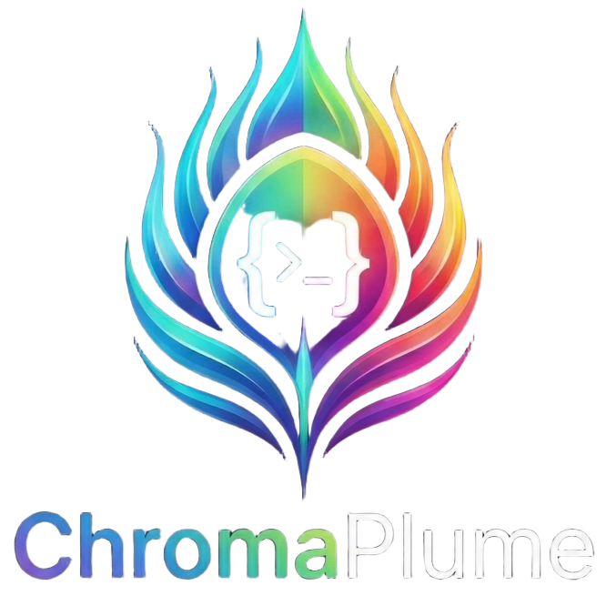

<p align="center">
  
</p>

<h1 align="center">ChromaPlume</h1>

<p align="center">
  <em>Sync your feathers. Code in color.</em>
</p>

  

ChromaPlume is the missing bridge between OpenCode's open-source intelligence and Peacock's vibrant plugin ecosystem. Think of it as the iridescent layer that lets your IDE strut its stuff.

---

## Why ChromaPlume?

Ever tried getting a peacock to talk to a... well, whatever bird represents OpenCode? It's a mess of incompatible feathers—uh, APIs. ChromaPlume swoops in like that one friend who speaks both languages at parties, translating between your AI coding assistant and your favorite development tools with zero drama.

- **Prismatic Sync**: Translates between OpenCode and Peacock protocols without losing fidelity
- **Featherweight**: Zero dependencies, sub-100ms overhead
- **Plug-and-Plume**: Works with existing configs—no migration headaches
- **Chromatic Confidence**: Built-in validation ensures your colors (and code) never clash

---

## Quick Start

### Installation

```bash
# npm
npm install -g chromaplume

# or if you prefer living on the edge
curl -fsSL https://get.chromaplume.dev | bash
```

### Your First Sync

```bash
# Initialize your iridescent config
chromaplume init

# Sync all the things!
chromaplume sync --watch

# Feeling fancy? Sync with style
chromaplume iridescence --profile=prismatic
```

---

## Configuration

ChromaPlume looks for `.chromaplume.yml` in your project root. Here's a config that actually understands you:

```yaml
# .chromaplume.yml
sync:
  direction: bidirectional  # because one-way streets are for traffic
  strategy: prismatic       # merge with color-coded confidence

sources:
  - type: opencode
    endpoint: ${OPENCODE_API_URL}
    palette: full           # sync everything, regret nothing

targets:
  - type: peacock
    plugins:
      - rainbow-brackets
      - semantic-highlight
    theme: "vibrant-dark"   # embrace the darkness. with colors.

# Pro tip: Use environment variables for your secrets
# because hardcoding is so last season
```

---

## Advanced Usage

### Sync Specific Feathers

```bash
# Only sync bracket colorization
chromaplume sync --feathers=brackets,themes

# Dry run (practice your strut)
chromaplume sync --dry-run --verbose
```

### Custom Transformations

```javascript
// chromaplume.config.js
module.exports = {
  transform: {
    // Add your own iridescent magic
    beforeSync: (payload) => ({
      ...payload,
      shimmerIntensity: 'maximum'
    })
  }
}
```

---

## Ecosystem

| Plugin | Description | Status |
|--------|-------------|--------|
| `chromaplume-brackets` | Rainbow bracket sync | Stable |
| `chromaplume-themes` | Color theme translation | Stable |
| `chromaplume-semantic` | Semantic highlighting | Beta |

---

## Contributing

We welcome contributions from all birds of a feather! Whether you're a peacock, a sparrow, or somewhere in between:

1. Fork the repo and clone it
2. Create a feature branch: `git checkout -b feature/my-iridescent-idea`
3. Make your changes (add tests, please!)
4. Run the test suite: `npm test`
5. Submit a pull request with a colorful description

Read our [Contributing Guide](CONTRIBUTING.md) for the full plumage protocol.

---

## License

MIT License - because open source should be as free as a bird in flight.

---

## Acknowledgments

- The OpenCode team for building something worth syncing *to*
- The Peacock maintainers for making IDEs beautiful
- Every developer who's ever yelled "why don't these tools just TALK to each other?!"

---

<div align="center">
  <sub>Made with love by a developer who believes your tools should be as vibrant as your code</sub>
</div>
